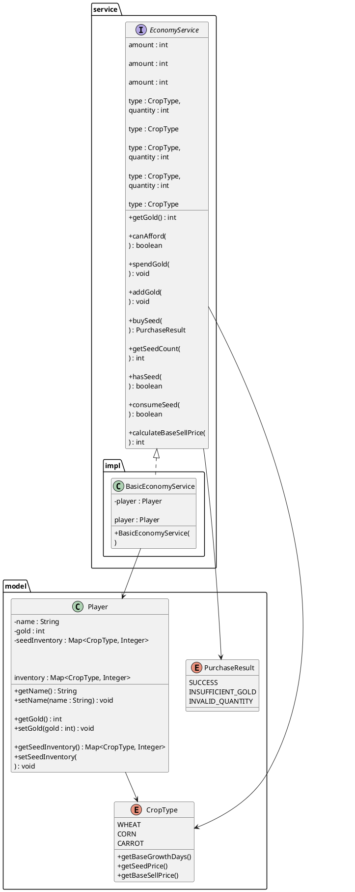

## 1. 模块定位

**模块：** B——玩家与经营模块  
**阶段：** P0 `v0.1.0-core`  
**P0职责：**

```text
金币
种子库存
种子购买
基础售价
统一经济接口
```

P0经营闭环为：

```text
开垦 → 买种 → 播种 → 浇水 → 成长 → 收获 → 出售 → 再种
```

P0规范明确要求 `EconomyService` 负责金币与种子购买相关业务，且Controller不得直接修改玩家金币。

---

# 2. 设计原则

B模块遵守以下原则：

```text
Model
只保存状态

Service
负责业务规则和状态变化

Controller
只调用Service

其他模块
通过B提供的接口参与经济操作
```

项目统一要求Model只表达当前状态，Service负责状态变化。

---

# 3. 包结构

按照团队统一规范，不新增 `model.economy` 或 `service.economy` 子包。

```text
com.fieldstory.farm

├── model
│   ├── Player.java
│   ├── CropType.java
│   └── PurchaseResult.java
│
├── service
│   └── EconomyService.java
│
└── service.impl
    └── BasicEconomyService.java
```

其中：

- `Player`：具体Model类，不拆接口。
- `CropType`：A/B/C共用，不由B重复定义。
- `PurchaseResult`：B定义的购买结果枚举。
- `EconomyService`：B对外经济接口。
- `BasicEconomyService`：P0默认经济实现。

---

# 4. Player 类设计

## 4.1 职责

`Player`只保存玩家状态。

P0主要状态：

```java
public class Player {

    private String name;

    private int gold;

    private Map<CropType, Integer> seedInventory;

}
```

其中正式P0初始金币：

```text
500
```

种子初始库存：

```text
WHEAT  = 0
CORN   = 0
CARROT = 0
```

P0规范明确要求Player保存种子库存：

```java
Map<CropType, Integer> seedInventory;
```

并规定买种时金币减少、库存增加，播种时只减少种子。

---

## 4.2 Player允许提供

```java
String getName();

void setName(String name);

int getGold();

void setGold(int gold);

Map<CropType, Integer> getSeedInventory();

void setSeedInventory(
    Map<CropType, Integer> seedInventory
);
```

这些方法用于：

- Service访问状态；
- E模块JSON/SQLite保存与恢复；
- GameManager组装游戏状态。

---

## 4.3 Player禁止承担

Player自身不负责：

```text
检查金币是否足够
扣金币
加金币
购买种子
消耗种子
计算售价
```

这些业务统一由：

```text
EconomyService
```

负责。

---

# 5. CropType 使用约定

B模块不创建 `SeedType`。

全项目统一使用：

```java
public enum CropType {

    WHEAT(...),
    CORN(...),
    CARROT(...);

}
```

按照团队D12约定，`CropType`已经保存：

```text
baseGrowthDays
seedPrice
baseSellPrice
```

B直接使用：

```java
type.getSeedPrice();

type.getBaseSellPrice();
```

禁止B再次通过：

```java
switch (type)
```

重复定义10/15/20和50/70/60。

正式规则确实将种子价格和基础售价与三种CropType绑定。

---

# 6. PurchaseResult 枚举

```java
package com.fieldstory.farm.model;

public enum PurchaseResult {

    SUCCESS,

    INSUFFICIENT_GOLD,

    INVALID_QUANTITY

}
```

说明：

| 值 | 含义 |
|---|---|
| `SUCCESS` | 购买成功 |
| `INSUFFICIENT_GOLD` | 金币不足 |
| `INVALID_QUANTITY` | 数量非法 |

---

# 7. EconomyService 接口

## 7.1 职责

`EconomyService`是B模块P0唯一经济业务入口。

其他模块不得直接：

```java
player.setGold(...);

player.getSeedInventory().put(...);
```

---

## 7.2 接口定义

```java
package com.fieldstory.farm.service;

import com.fieldstory.farm.model.CropType;
import com.fieldstory.farm.model.PurchaseResult;

public interface EconomyService {

    /**
     * 获取当前金币。
     */
    int getGold();


    /**
     * 判断是否能够支付指定金额。
     */
    boolean canAfford(int amount);


    /**
     * 扣除指定金币。
     */
    void spendGold(int amount);


    /**
     * 增加指定金币。
     */
    void addGold(int amount);


    /**
     * 购买指定数量种子。
     */
    PurchaseResult buySeed(
            CropType type,
            int quantity
    );


    /**
     * 获取指定种子库存。
     */
    int getSeedCount(
            CropType type
    );


    /**
     * 判断指定种子是否足够。
     */
    boolean hasSeed(
            CropType type,
            int quantity
    );


    /**
     * 消耗指定数量种子。
     */
    boolean consumeSeed(
            CropType type,
            int quantity
    );


    /**
     * 获取P0基础售价。
     */
    int calculateBaseSellPrice(
            CropType type
    );
}
```

其中P0验收规范至少明确要求：

```java
boolean canAfford(int amount);

void spendGold(int amount);

void addGold(int amount);

PurchaseResult buySeed(
    CropType type,
    int quantity
);

int calculateBaseSellPrice(
    CropType type
);
```


---

# 8. BasicEconomyService 类设计

```java
package com.fieldstory.farm.service.impl;

import com.fieldstory.farm.model.CropType;
import com.fieldstory.farm.model.Player;
import com.fieldstory.farm.model.PurchaseResult;
import com.fieldstory.farm.service.EconomyService;

public class BasicEconomyService
        implements EconomyService {

    private final Player player;

    public BasicEconomyService(Player player) {
        this.player = player;
    }
}
```

依赖关系：

```text
EconomyService
        ▲
        │ implements
BasicEconomyService
        │
        ▼
      Player
```

---

# 9. BasicEconomyService 业务规则

## 9.1 查询金币

```java
getGold()
```

返回：

```java
player.getGold();
```

---

## 9.2 金币判断

```java
canAfford(amount)
```

规则：

```text
amount >= 0
并且
player.gold >= amount
```

---

## 9.3 金币支出

```java
spendGold(amount)
```

规则：

```text
amount < 0
→ 非法参数

金币不足
→ 不修改Player

金币足够
→ gold -= amount
```

不得产生：

```text
gold < 0
```

---

## 9.4 金币收入

```java
addGold(amount)
```

规则：

```text
amount < 0
→ 非法参数

否则
→ gold += amount
```

---

# 10. 种子购买规则

调用：

```java
economyService.buySeed(
        CropType.WHEAT,
        2
);
```

内部流程：

```text
检查quantity > 0
↓
读取 type.getSeedPrice()
↓
计算总价
↓
检查金币
↓
扣金币
↓
种子库存增加
↓
返回SUCCESS
```

示例：

```text
WHEAT 单价 = 10

购买2颗
→ 总价20
→ 金币-20
→ WHEAT库存+2
```

必须保证：

```text
扣金币
+
增加库存
```

属于一次完整业务。

失败时：

```text
金币不变
库存不变
```

---

# 11. 种子库存规则

## 查询

```java
getSeedCount(CropType type)
```

返回：

```java
player.getSeedInventory()
      .getOrDefault(type, 0);
```

---

## 判断

```java
hasSeed(type, quantity)
```

判断：

```text
quantity > 0
且
当前库存 >= quantity
```

---

## 消耗

```java
consumeSeed(type, quantity)
```

成功：

```text
库存 -= quantity
返回 true
```

失败：

```text
库存不变
返回 false
```

播种阶段只减少种子，不再次扣金币。

---

# 12. 基础售价规则

```java
calculateBaseSellPrice(
        CropType type
)
```

实现：

```java
return type.getBaseSellPrice();
```

禁止：

```java
switch (type) {
    case WHEAT -> 50;
    ...
}
```

避免B与 `CropType` 出现两份价格数据。

P0阶段：

```text
FinalPrice = BasePrice
```

P1以后再增加品质等倍率。

---

# 13. 与A模块的接口使用

## 13.1 开垦土地

A负责：

```text
判断土地是否合法
EMPTY → TILLED
```

B负责：

```text
检查金币
扣除5金币
```

调用方式：

```java
if (!economyService.canAfford(5)) {

    // A按自己的Result类型返回失败
    return;
}

economyService.spendGold(5);

// 后续土地状态变化由A处理
```

B文档不定义A的：

```text
ReclaimResult
PlantingResult
WateringResult
```

具体枚举名称。

---

# 14. 与A播种逻辑的接口使用

A负责：

```text
检查土地是否TILLED
创建Crop
TILLED → PLANTED
```

B负责：

```text
检查种子
消耗种子
```

调用：

```java
if (!economyService.consumeSeed(
        cropType,
        1)) {

    // A按自身接口约定返回失败
    return;
}

// A继续执行PlantingService逻辑
```

禁止：

```text
播种时再次扣金币
```

---

# 15. 与C模块的接口使用

C模块正式名称：

```text
品质与传说模块
```

P0负责：

```text
基础收获
```

---

## 15.1 收获经济流程

C通过B计算售价：

```java
int price =
        economyService.calculateBaseSellPrice(
                crop.getCropType()
        );

economyService.addGold(price);
```

---

## 15.2 收获后的土地状态

C不得直接：

```java
soil.setCrop(null);

soil.setState(
    SoilState.TILLED
);
```

土地状态机属于A模块。

按照D09，C应调用A提供的：

```java
landService.removeCropAndSetTilled(soil);
```

因此P0完整收获协作流程为：

```text
BasicHarvestService
↓
检查Crop是否MATURE
↓
获取CropType
↓
调用EconomyService计算售价
↓
EconomyService.addGold()
↓
调用A：
LandService.removeCropAndSetTilled(soil)
↓
保存
↓
刷新UI
```

旧P0规范要求收获最终结果为增加金币、移除Crop并将土地恢复为TILLED。

D09进一步确定：

> 土地状态修改必须经过A的LandService。

---

# 16. 与E模块的接口约定

E负责：

```text
JSON存档
SQLite
DAO
GameState持久化
```

B只保证Player能够保存和恢复：

```text
name
gold
seedInventory
```

E读取：

```java
player.getGold();

player.getSeedInventory();
```

恢复时通过：

```java
Player构造方法
```

或：

```java
setter
```

完成状态恢复。

P0存档至少需要包含金币和种子库存。

---

# 17. 跨模块接口表

| 调用模块 | B接口 | 用途 |
|---|---|---|
| A 土地 | `canAfford(5)` | 判断能否开垦 |
| A 土地 | `spendGold(5)` | 扣除开垦金币 |
| A 播种 | `hasSeed(type,1)` | 查询种子 |
| A 播种 | `consumeSeed(type,1)` | 消耗种子 |
| B Controller/UI | `buySeed(type,n)` | 购买种子 |
| B UI | `getGold()` | 显示金币 |
| B UI | `getSeedCount(type)` | 显示库存 |
| C 收获 | `calculateBaseSellPrice(type)` | 获取基础售价 |
| C 收获 | `addGold(price)` | 发放出售金币 |
| E 存档 | `Player` | 保存/恢复经济状态 |

---

# 18. B模块边界

## B负责

```text
金币状态
种子库存
买种
种子消耗
金币收入
金币支出
基础售价
```

## B不负责

```text
土地状态判断
土地状态修改
Crop创建
Crop成长
Crop成熟判断
收获合法性
品质
传说
天气
存档文件读写
```

---

# 19. 最终类图 PlantUML



---

# 20. 最终文件清单

B模块P0最终需要新增或修改：

```text
model/
├── Player.java              // 修改
├── PurchaseResult.java      // 新增
└── CropType.java            // A/B共用，B不重复建立

service/
└── EconomyService.java      // 新增

service/impl/
└── BasicEconomyService.java // 新增
```

最终依赖关系：

```text
A ──────┐
        │
B UI ───┼──→ EconomyService
        │          ↓
C ──────┘   BasicEconomyService
                   ↓
                 Player

C收获完成后
        ↓
调用A的LandService
        ↓
修改土地状态

E
↓
保存 / 恢复 Player
```

---

# 21. 最终设计结论

B模块P0统一采用：

```text
Player
+
EconomyService
+
BasicEconomyService
+
PurchaseResult
+
共享CropType
```

其中：

> **Player只保存玩家经济状态。**

> **BasicEconomyService统一处理金币、种子和基础售价业务。**

> **价格只读取CropType，不在B重复定义。**

> **A负责土地状态机，C收获后必须调用A的LandService。**

> **B不创建新的子包，也不替A/C定义结果枚举或状态变化规则。**

该设计满足P0经济闭环，同时保持A/B/C/E模块边界清晰。