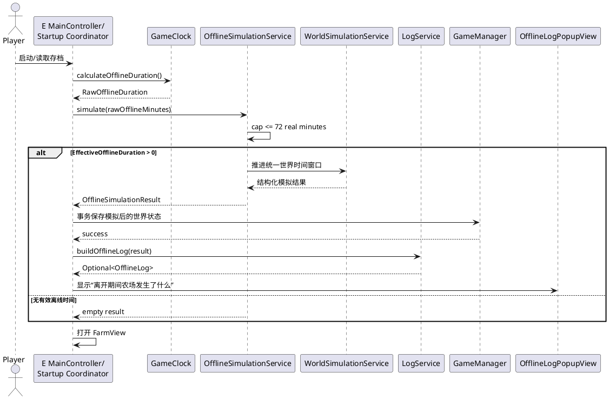

# 《田野物语 · 三韵集》
# B 模块 P2 接口与类设计文档

**文档编号：** B-P2-DESIGN  
**版本：** v1.0  
**阶段：** P2 / v0.3.0-feature  
**模块：** B——玩家与经营模块  
**主要职责：** 离线模拟、离线日志  
**包名：** `com.fieldstory.farm`  
**文档状态：** 设计冻结候选  
**日期：** 2026-09-14

---

# 1. 文档定位

本文定义 B 模块进入 P2 后的正式职责边界、接口、类、依赖关系、数据模型、测试边界及跨模块协作约定。

本文是**设计文档**，不是 As-Built 文档。未实现的类不得在后续说明中表述为已经存在。

上位规则优先级如下：

1. 《FSF游戏规则设计文档》——唯一游戏规则事实源；
2. 《FSF_P0-P4功能实现与验收规范》——阶段实现及验收红线；
3. 《模块分工》——模块职责边界；
4. B 模块 P1 As-Built——P2 开发前实际接口基线。

《游戏规则设计文档》明确规定，其内容是后续 Java 代码、数据库、测试等的唯一规则事实源，发生冲突时以该文档为最终规则。

---

# 2. P2 模块职责

## 2.1 B 模块 P2 正式职责

模块分工中 B 的 P2 责任为：

> **离线模拟 + 离线日志，并且必须沿用世界环境模块规则。**

同时，A 负责持续世界引擎，C 负责完整收获事务、传奇与生命记忆，D 负责随机事件，E 负责持久化。

因此 B P2 正式负责：

- 计算并限制一次离线模拟的有效时间窗口；
- 调用统一的 `WorldSimulationService` 推进世界；
- 收集本次离线模拟产生的结构化结果；
- 将结构化结果转换为玩家可读的离线日志；
- 提供离线日志 Controller / View；
- 为 E 模块启动流程提供离线模拟和日志能力。

B P2 **不拥有第二套世界规则**。

---

# 3. P2 前置基线

进入本设计前，B 模块以下 P0/P1 接口继续冻结：

```java
EconomyService
ShopService
DecorationService
BuffService
```

P1 当前正式接口包括种子购买、装饰购买、装饰放置以及统一 `BuffSnapshot` 查询。

P2 原则：

```text
EconomyService        不改购买/库存语义
ShopService           不改现有种子购买语义
DecorationService     不改 place/move/remove 语义
BuffService           继续以 BuffSnapshot 为统一输出
```

P2 启动基线同时包括：

```text
D01-D07 = 1×1
D08-D14 = 2×2

播种菜单：
种子类型 × 剩余数量
库存经 EconomyService.getSeedCount() 查询
```

不得重新把种子库存访问改回 `Player.seedInventory`。

---

# 4. P2 最重要的架构约束

验收规范正式列出了：

```text
WorldSimulationService
OfflineSimulationService
LogService
```

均属于 P2 新增/升级 Service。

同时明确禁止：

```text
OfflineSimulationService
拥有一套独立成长公式
```

必须复用在线世界规则。

因此 B P2 的核心架构固定为：

```text
E 启动装配层
      │
      │ RawOfflineDuration
      ▼
OfflineSimulationService             [B]
      │
      │ 有效时间窗口
      ▼
WorldSimulationService               [A]
      │
      ├── 天气/日结规则
      ├── Growth / Wither
      ├── BuffService                 [B P1]
      ├── EventService                [D P2]
      └── MemoryService               [C P2]
      │
      ▼
结构化世界模拟结果
      │
      ▼
OfflineSimulationResult              [B]
      │
      ▼
LogService                           [B]
      │
      ▼
OfflineLog
      │
      ▼
OfflineLogController
      │
      ▼
OfflineLogPopupView
```

`OfflineSimulationService` 是**编排层**，不是世界规则实现层。

---

# 5. 离线时间规则

正式时间比例为：

```text
1 现实分钟 = 1 游戏小时
24 现实分钟 = 1 游戏日
```

规则文档维持该时间比例。

离线上限：

```text
EffectiveOfflineDuration
=
min(
    RawOfflineDuration,
    72 现实分钟
)
```

即一次最多：

```text
72 游戏小时
=
3 游戏日
```

超过部分：

```text
不模拟
不补偿
```


因此 B 模块只允许出现一个离线上限常量：

```java
72L
```

禁止在 Controller、View、Service、测试中分别硬编码。

---

# 6. OfflineTimePolicy

## 6.1 文件

```text
src/main/java/com/fieldstory/farm/util/OfflineTimePolicy.java
```

## 6.2 职责

纯规则类：

```text
RawOfflineDuration
        ↓
72 分钟 cap
        ↓
EffectiveOfflineDuration
        ↓
游戏小时
```

## 6.3 设计接口

```java
public final class OfflineTimePolicy {

    public static final long MAX_OFFLINE_REAL_MINUTES = 72L;

    private OfflineTimePolicy() {
    }

    public static long effectiveMinutes(long rawOfflineMinutes);

    public static long toGameHours(long effectiveRealMinutes);
}
```

冻结语义：

```text
effectiveMinutes(30)  = 30
effectiveMinutes(72)  = 72
effectiveMinutes(480) = 72

toGameHours(30) = 30
toGameHours(72) = 72
```

上位规则未规定负离线时长的业务语义，因此本设计将：

```text
rawOfflineMinutes < 0
```

定义为非法输入，抛出 `IllegalArgumentException`。这属于输入防御设计，不属于游戏数值规则。

---

# 7. OfflineSimulationService

## 7.1 文件

```text
src/main/java/com/fieldstory/farm/service/OfflineSimulationService.java
```

## 7.2 正式接口

```java
public interface OfflineSimulationService {

    OfflineSimulationResult simulate(long rawOfflineMinutes);
}
```

## 7.3 职责

`OfflineSimulationService` 只负责：

```text
校验 RawOfflineDuration
↓
执行 72 分钟上限
↓
换算有效游戏小时
↓
调用 WorldSimulationService
↓
包装 OfflineSimulationResult
```

不负责：

```text
计算天气
计算成长
计算枯萎
主动浇水
主动施肥
购买
移动装饰
主动收获
随机事件概率
传奇概率
生命故事
SQLite
```

验收规范明确要求在线与离线调用同一套世界领域逻辑，不能开发：

```text
OnlineDailyService 一套算法
OfflineSimulationService 另一套算法
```

P2 `OfflineSimulationService` 只是按时间窗口调用统一 `WorldSimulationService`。

---

# 8. BasicOfflineSimulationService

## 8.1 文件

```text
src/main/java/com/fieldstory/farm/service/impl/BasicOfflineSimulationService.java
```

## 8.2 实现关系

```java
public final class BasicOfflineSimulationService
        implements OfflineSimulationService {
}
```

## 8.3 正式依赖

核心依赖只允许：

```text
WorldSimulationService
OfflineTimePolicy
```

设计：

```java
public BasicOfflineSimulationService(
        WorldSimulationService worldSimulationService
)
```

## 8.4 禁止依赖

不得直接注入以下主动行为 Service：

```text
ShopService
PlantingService
WateringService
FertilizerService
HarvestService
DecorationService 的 move/place 操作
```

也不得通过：

```text
GrowthService
WeatherService
WitherService
EventService
```

重新拼接一套离线世界算法。

这些规则必须封装于统一世界模拟流程中。

---

# 9. 与 A 模块 WorldSimulationService 的协作合同

`WorldSimulationService` 属于 P2 正式 Service，同时持续世界引擎归 A 模块。

本 B 文档**不冻结 A 模块的方法名称或实现类名称**。

B 只冻结以下语义要求：

```text
输入：
需要推进的游戏时间窗口

输出：
本次窗口内产生的结构化世界模拟结果
```

A 的 `WorldSimulationService` 内部必须负责正确分段。

正式离线模拟不能简单：

```text
offlineHours / 24
```

而必须按：

```text
游戏日 00:00 边界
+
事件结束时间
+
作物成熟时间
```

分段。

因此 B 不允许自行：

```java
for (day ...)
    growthService.applyGrowth(...);
```

这种代码属于违规实现。

---

# 10. 统一世界日结顺序

`WorldSimulationService` 应确保在线和离线共享以下规则顺序：

```text
① 处理当前时间段成长
② 更新 GrowthStage
③ 标记成熟
④ 到达日结边界
⑤ 处理补水
⑥ 更新 droughtStreak
⑦ 枯萎判定
⑧ 关闭过期 Event
⑨ 保存 DailyLog
⑩ GameDay + 1
⑪ 生成新 Weather
⑫ 雨天自动补水
⑬ 抽取当天 Event
⑭ 继续下一时间段
```


B 只消费其结果，不重新实现上述步骤。

---

# 11. OfflineSimulationResult

## 11.1 文件

```text
src/main/java/com/fieldstory/farm/model/OfflineSimulationResult.java
```

## 11.2 职责

描述：

> “本次离线模拟实际处理了多久、是否触发 cap、期间发生了哪些结构化事实。”

Model 只保存结果，不包含计算逻辑。

## 11.3 设计

```java
public record OfflineSimulationResult(
        long rawOfflineMinutes,
        long effectiveOfflineMinutes,
        long simulatedGameHours,
        List<OfflineDaySummary> dailySummaries
) {

    public boolean hasOfflineProgress();

    public boolean wasCapped();
}
```

语义：

```text
rawOfflineMinutes
= 玩家实际离线时长

effectiveOfflineMinutes
= min(raw, 72)

simulatedGameHours
= effectiveOfflineMinutes

dailySummaries
= 统一世界模拟产生的按日结构化事实
```

集合必须 defensive copy。

---

# 12. OfflineDaySummary

## 12.1 文件

```text
src/main/java/com/fieldstory/farm/model/OfflineDaySummary.java
```

## 12.2 设计

```java
public record OfflineDaySummary(
        long gameDay,
        List<OfflineOccurrence> occurrences
) {
}
```

它对应规则文档中的：

```text
DailyOfflineLog / DailyLog
```

但这里只存结构化事实，不直接承担 JavaFX UI。

---

# 13. OfflineOccurrence

## 13.1 文件

```text
src/main/java/com/fieldstory/farm/model/OfflineOccurrence.java
```

为避免一个 record 出现大量 nullable 字段，本设计采用 Java 17 `sealed interface`：

```java
public sealed interface OfflineOccurrence {

    record Weather(
            WeatherType weather
    ) implements OfflineOccurrence {}

    record AutoWater(
            CropType cropType,
            int count
    ) implements OfflineOccurrence {}

    record Growth(
            CropType cropType,
            GrowthStage stage,
            int count
    ) implements OfflineOccurrence {}

    record Mature(
            CropType cropType,
            int count
    ) implements OfflineOccurrence {}

    record Withered(
            CropType cropType,
            int count
    ) implements OfflineOccurrence {}

    record Event(
            EventType eventType
    ) implements OfflineOccurrence {}

    record LegendaryOpportunity(
            CropType cropType,
            int count
    ) implements OfflineOccurrence {}

    record Reward(
            String description
    ) implements OfflineOccurrence {}
}
```

该模型只表达“发生了什么”。

不得在这些 record 中实现：

```text
成长计算
品质计算
事件随机
枯萎概率
传奇概率
```

---

# 14. 离线期间允许和禁止的行为

离线期间正式允许：

```text
时间推进
天气变化
作物成长
雨水自动补水
装饰 Buff
枯萎
成熟
随机事件
生命经历记录
```

正式禁止：

```text
主动浇水
主动施肥
购买
移动装饰
主动收获
```


因此：

```text
OfflineSimulationService
```

不得调用主动玩家行为 API。

---

# 15. 离线成熟规则

作物离线期间成熟：

```text
stage = MATURE
```

但：

```text
不自动出售
不自动收获
不最终结算品质
```

玩家回来后必须亲自收获。

因此以下行为属于严重错误：

```java
harvestService.harvest(soil);
economyService.addGold(...);
```

不得出现在离线模拟代码中。

---

# 16. BuffService 在 P2 的位置

P1 已经提供统一：

```java
BuffSnapshot getSnapshot(
        int row,
        int column,
        CropType cropType
);
```

以及 Growth / Quality / Price / Wither / Operation 等统一查询接口。

P2 世界模拟中，装饰 Buff 的正式消费链应为：

```text
WorldSimulationService
        ↓
BuffService
        ↓
BuffSnapshot
```

而不是：

```text
OfflineSimulationService
        ↓
BasicBuffService
        ↓
手工成长计算
```

在线与离线因此才能消费同一套 Buff 规则。

---

# 17. LogService

## 17.1 文件

```text
src/main/java/com/fieldstory/farm/service/LogService.java
```

## 17.2 正式接口

```java
public interface LogService {

    Optional<OfflineLog> buildOfflineLog(
            OfflineSimulationResult result
    );
}
```

## 17.3 职责

```text
OfflineSimulationResult
        ↓
结构化 OfflineDaySummary
        ↓
转换为玩家可阅读叙事
        ↓
OfflineLog
```

当：

```text
effectiveOfflineMinutes == 0
```

时：

```java
Optional.empty()
```

不展示离线日志。

---

# 18. BasicLogService

## 18.1 文件

```text
src/main/java/com/fieldstory/farm/service/impl/BasicLogService.java
```

## 18.2 实现关系

```java
public final class BasicLogService
        implements LogService {
}
```

## 18.3 职责

只负责：

```text
结构化事实
→ 中文玩家叙事
```

例如：

```text
Weather(RAIN)
→ 🌧 下了一场雨

AutoWater(CORN, 3)
→ 3株玉米获得了自动补水

Mature(WHEAT, 4)
→ 4株小麦成熟

Event(MYSTERY_MERCHANT)
→ 神秘商人来到农场
```

规则明确要求离线日志不能只显示技术数据。

---

# 19. OfflineLog

## 19.1 文件

```text
src/main/java/com/fieldstory/farm/model/OfflineLog.java
```

## 19.2 设计

```java
public record OfflineLog(
        long effectiveOfflineMinutes,
        List<DailyOfflineLog> days
) {
}
```

集合采用 defensive copy。

---

# 20. DailyOfflineLog

## 20.1 文件

```text
src/main/java/com/fieldstory/farm/model/DailyOfflineLog.java
```

## 20.2 设计

```java
public record DailyOfflineLog(
        long gameDay,
        List<String> lines
) {
}
```

日志必须：

```text
按游戏日分组
```

重点展示：

```text
天气
成熟
枯萎
特殊事件
传说机会
奖励
```


---

# 21. OfflineLogController

## 21.1 文件

```text
src/main/java/com/fieldstory/farm/controller/OfflineLogController.java
```

## 21.2 依赖

```java
private final LogService logService;
```

## 21.3 设计接口

```java
public final class OfflineLogController {

    public OfflineLogController(
            LogService logService
    );

    public Optional<OfflineLog> buildLog(
            OfflineSimulationResult result
    );
}
```

Controller：

```text
不直接访问数据库
不计算世界规则
不计算离线 cap
不格式化具体世界规则
```

---

# 22. OfflineLogPopupView

## 22.1 文件

```text
src/main/java/com/fieldstory/farm/view/OfflineLogPopupView.java
```

## 22.2 职责

显示：

```text
离开期间农场发生了什么
```

并按：

```text
第 N 日
    天气
    成熟
    枯萎
    事件
    奖励
```

分组展示。

本 View：

```text
只渲染 OfflineLog
不调用 OfflineSimulationService
不访问 DAO
不改变 Crop
```

是否弹出由 E 启动装配层决定。

---

# 23. 启动时序

正式启动顺序必须为：

```text
启动程序
↓
初始化数据库
↓
读取 Player
↓
读取 Farm
↓
读取 Soil/Crop
↓
读取 WorldState
↓
读取 ActiveEvent
↓
计算 RawOfflineDuration
↓
OfflineSimulationService
↓
事务保存模拟结果
↓
生成 OfflineLog
↓
打开 FarmView
```


绝对禁止：

```text
先显示 FarmView
↓
再后台修改作物
```

---

# 24. GameClock 与离线时间来源

所有正式时间逻辑使用统一 `GameClock`。

当前 `GameClock` 已负责：

```text
getRealTime()
getGameDay()
getGameHour()
calculateOfflineDuration()
```

B 的 `OfflineSimulationService` 不直接调用：

```java
System.currentTimeMillis();
LocalDateTime.now();
```

进行游戏计算。

B 接收：

```java
long rawOfflineMinutes
```

可以避免 B 再建立第二套系统时间源。

---

# 25. 持久化边界

P2 正式数据库新增：

```text
offline_log
event_log
crop_memory
active_event
```


对应 DAO 清单包括：

```text
OfflineLogDao
EventLogDao
CropMemoryDao
ActiveEventDao
```


但是：

```text
B 不持有 JDBC Connection
B 不执行 SQL
B 不创建 migration
B 不实现 SQLite DAO
```

E 继续负责：

```text
数据库初始化
事务保存
DAO 实现
SQLite 落盘
```

B 的 `LogService` 负责生成日志领域模型，不负责 JDBC。

若 E 后续要求 `LogService -> OfflineLogDao` 注入，应在 E P2 DAO 接口冻结后另行联调，B 不自行定义 E 的 DAO 实现。

---

# 26. P2 与其他模块的正式依赖

| 模块 | B P2 的关系 |
|---|---|
| A | B 调用 `WorldSimulationService`；A 持续世界引擎负责统一世界推进 |
| B P1 | 世界引擎消费 `BuffService`；Economy/Shop/Decoration 接口保持冻结 |
| C | `MemoryService`、`LegendaryService`、完整 Harvest 仍归 C；B 不重写 |
| D | `GameClock` 提供统一时间，`EventService` 提供事件规则；B 不重新 roll 事件 |
| E | 启动顺序、DAO、SQLite、事务保存、最终装配由 E 负责 |

P2 模块边界必须维持：B 的责任是离线模拟和离线日志，而随机事件、生命记忆、传奇及持久化各有明确模块归属。

---

# 27. B P2 新增文件清单

```text
com.fieldstory.farm
│
├── model
│   ├── OfflineSimulationResult.java
│   ├── OfflineDaySummary.java
│   ├── OfflineOccurrence.java
│   ├── OfflineLog.java
│   └── DailyOfflineLog.java
│
├── service
│   ├── OfflineSimulationService.java
│   └── LogService.java
│
├── service.impl
│   ├── BasicOfflineSimulationService.java
│   └── BasicLogService.java
│
├── controller
│   └── OfflineLogController.java
│
├── view
│   └── OfflineLogPopupView.java
│
└── util
    └── OfflineTimePolicy.java
```

共：

```text
12 个 B P2 新类型文件
```

---

# 28. P1 文件修改原则

原则上不因离线模拟重写：

```text
EconomyService
EconomyServiceImpl

ShopService
BasicShopService

DecorationService
BasicDecorationService

BuffService
BasicBuffService

ShopController
DecorationController

SeedShopView
DecorationShopView
WarehousePopupView
DecorationOverlayView
BusinessToolbarView
```

其中 `BuffService` 是 P2 世界引擎继续复用的正式跨模块接口。

---

# 29. 测试设计

全项目 P2 正式测试要求包含：

```text
OfflineSimulationServiceTest
WorldSimulationServiceTest
EventServiceTest
LegendaryServiceTest
MemoryServiceTest
HarvestServiceTest
OfflineCapTest
DeterministicRandomTest
```


B 模块直接负责：

```text
OfflineSimulationServiceTest
OfflineCapTest
LogServiceTest
OfflineLogControllerTest
```

其中：

### 29.1 30 分钟

```text
raw = 30
effective = 30
gameHours = 30
```

必须要求世界引擎推进 30 游戏小时。

### 29.2 离开 8 小时

```text
raw = 480
effective = 72
gameHours = 72
wasCapped = true
```

### 29.3 零离线时间

```text
raw = 0
effective = 0
```

要求：

```text
WorldSimulationService 不推进
LogService 不生成弹窗日志
```

### 29.4 离线成熟

集成测试必须保证：

```text
GrowthStage = MATURE
金币不因自动出售增加
```

### 29.5 雨天

集成测试必须保证：

```text
rainCount + 1
manualWaterCount 不增加
```

正式验收明确要求上述边界。

---

# 30. B P2 类图

以下 PlantUML 为 B P2 正式类图。

```plantuml
@startuml

skinparam classAttributeIconSize 0
skinparam packageStyle rectangle

package "B - P0/P1 Frozen" {

    interface EconomyService
    interface ShopService
    interface DecorationService
    interface BuffService

    class BasicShopService
    class BasicDecorationService
    class BasicBuffService

    class BuffSnapshot <<record>>

    BasicShopService ..|> ShopService
    BasicDecorationService ..|> DecorationService
    BasicBuffService ..|> BuffService

    BasicShopService --> EconomyService
    BasicShopService --> DecorationService
    BasicBuffService --> DecorationService

    BuffService --> BuffSnapshot
}

package "B - P2 Offline Simulation" {

    interface OfflineSimulationService {
        +simulate(rawOfflineMinutes : long) : OfflineSimulationResult
    }

    class BasicOfflineSimulationService {
        -worldSimulationService : WorldSimulationService
        +simulate(rawOfflineMinutes : long) : OfflineSimulationResult
    }

    class OfflineTimePolicy {
        {static} MAX_OFFLINE_REAL_MINUTES : long = 72
        {static} +effectiveMinutes(raw : long) : long
        {static} +toGameHours(minutes : long) : long
    }

    class OfflineSimulationResult <<record>> {
        rawOfflineMinutes : long
        effectiveOfflineMinutes : long
        simulatedGameHours : long
        dailySummaries : List<OfflineDaySummary>
        +hasOfflineProgress() : boolean
        +wasCapped() : boolean
    }

    class OfflineDaySummary <<record>> {
        gameDay : long
        occurrences : List<OfflineOccurrence>
    }

    interface OfflineOccurrence <<sealed>>

    class "OfflineOccurrence.Weather" <<record>>
    class "OfflineOccurrence.AutoWater" <<record>>
    class "OfflineOccurrence.Growth" <<record>>
    class "OfflineOccurrence.Mature" <<record>>
    class "OfflineOccurrence.Withered" <<record>>
    class "OfflineOccurrence.Event" <<record>>
    class "OfflineOccurrence.LegendaryOpportunity" <<record>>
    class "OfflineOccurrence.Reward" <<record>>

    BasicOfflineSimulationService ..|> OfflineSimulationService
    BasicOfflineSimulationService --> OfflineTimePolicy
    BasicOfflineSimulationService --> WorldSimulationService

    OfflineSimulationService --> OfflineSimulationResult
    OfflineSimulationResult "1" o-- "*" OfflineDaySummary
    OfflineDaySummary "1" o-- "*" OfflineOccurrence

    "OfflineOccurrence.Weather" ..|> OfflineOccurrence
    "OfflineOccurrence.AutoWater" ..|> OfflineOccurrence
    "OfflineOccurrence.Growth" ..|> OfflineOccurrence
    "OfflineOccurrence.Mature" ..|> OfflineOccurrence
    "OfflineOccurrence.Withered" ..|> OfflineOccurrence
    "OfflineOccurrence.Event" ..|> OfflineOccurrence
    "OfflineOccurrence.LegendaryOpportunity" ..|> OfflineOccurrence
    "OfflineOccurrence.Reward" ..|> OfflineOccurrence
}

package "B - P2 Offline Log" {

    interface LogService {
        +buildOfflineLog(result : OfflineSimulationResult) : Optional<OfflineLog>
    }

    class BasicLogService

    class OfflineLog <<record>> {
        effectiveOfflineMinutes : long
        days : List<DailyOfflineLog>
    }

    class DailyOfflineLog <<record>> {
        gameDay : long
        lines : List<String>
    }

    class OfflineLogController
    class OfflineLogPopupView

    BasicLogService ..|> LogService
    BasicLogService --> OfflineSimulationResult
    BasicLogService --> OfflineLog

    OfflineLog "1" o-- "*" DailyOfflineLog

    OfflineLogController --> LogService
    OfflineLogPopupView --> OfflineLogController
    OfflineLogPopupView --> OfflineLog
}

package "A - P2 External" {
    interface WorldSimulationService
}

package "C - P2 External" {
    interface MemoryService
    interface LegendaryService
    interface HarvestService
}

package "D - P2 External" {
    interface GameClock
    interface EventService
}

package "E - Persistence / Integration" {
    class MainController
    class GameManager
    interface OfflineLogDao
    class SqliteSaveService
}

' E controls startup orchestration
MainController --> GameClock : calculate offline duration
MainController --> OfflineSimulationService
MainController --> LogService
MainController --> GameManager

' B delegates all world rules to A
BasicOfflineSimulationService --> WorldSimulationService

' Unified world engine collaborates with existing domains
WorldSimulationService ..> BuffService : decoration buffs
WorldSimulationService ..> EventService : event rules
WorldSimulationService ..> MemoryService : life records

' Persistence remains E-owned
GameManager --> SqliteSaveService
SqliteSaveService ..> OfflineLogDao

note right of BasicOfflineSimulationService
B P2 red line:
NO Growth formula
NO Weather roll
NO Wither formula
NO Event roll
NO active harvest
end note

note right of WorldSimulationService
Exact Java method signature
is owned/frozen by A P2.
B only requires semantic contract:
advance one world-time window
with shared online/offline rules.
end note

@enduml
```

---

# 31. B P2 启动时序图



---

# 32. 依赖红线

下列实现一律判定为 B P2 架构错误：

```text
❌ OfflineSimulationService 内复制 Growth 公式

❌ OfflineSimulationService 自己 roll Weather

❌ OfflineSimulationService 自己 roll Event

❌ OfflineSimulationService 调用 HarvestService 自动收获

❌ 离线成熟后自动出售

❌ 离线期间调用 ShopService

❌ 离线期间 move Decoration

❌ Service 中直接 System.currentTimeMillis()

❌ B 持有 JDBC Connection

❌ B 自己创建 offline_log SQL 表

❌ View 直接操作 Crop / Player / DAO

❌ 先打开 FarmView，再后台修改作物
```

---

# 33. 当前唯一待跨模块冻结项

B P2 自身接口可按本文冻结。

唯一不能由 B 单方面冻结的是：

```text
A 模块 WorldSimulationService 的正式 Java 方法签名
以及其结构化模拟结果类型
```

上位文档已经冻结：

```text
必须存在统一 WorldSimulationService
在线与离线必须复用它
必须按时间窗口和关键边界推进
```

但没有冻结具体 Java 方法名。

因此在 A P2 接口确认前，B 不应擅自声明：

```java
advanceHours(...)
simulateUntil(...)
advanceWorld(...)
```

哪一个是项目正式接口。

B 只冻结自己的依赖语义：

> `BasicOfflineSimulationService` 必须将有效游戏时间窗口完整委托给 `WorldSimulationService`，并取得足够生成离线日志的结构化结果。

---

# 34. P2 开发顺序

```text
B-P2-0    已完成启动基线
           ├─ 大型装饰 footprint
           └─ 播种库存显示

B-P2-1    离线时间与服务外壳
           ├─ OfflineTimePolicy
           ├─ OfflineSimulationResult
           ├─ OfflineSimulationService
           ├─ BasicOfflineSimulationService
           ├─ OfflineCapTest
           └─ OfflineSimulationServiceTest

B-P2-2    A/B 世界引擎联调
           ├─ OfflineDaySummary
           ├─ OfflineOccurrence
           └─ WorldSimulationService integration

B-P2-3    离线日志
           ├─ LogService
           ├─ BasicLogService
           ├─ OfflineLog
           ├─ DailyOfflineLog
           └─ LogServiceTest

B-P2-4    UI 与启动流程联调
           ├─ OfflineLogController
           ├─ OfflineLogPopupView
           └─ E startup / persistence integration
```

---

# 35. 验收完成定义

B 模块 P2 只有同时满足以下条件才可宣布完成：

```text
72 分钟 cap 正确
+
30 分钟 → 30 游戏小时
+
8 小时 → 仅 72 游戏小时
+
离线调用统一 WorldSimulationService
+
不存在第二套成长/枯萎/天气/事件算法
+
离线成熟保持 MATURE 且不出售
+
离线无主动浇水/施肥/购买/移动/收获
+
日志按游戏日分组
+
日志为玩家可读叙事而非技术数据
+
模拟完成后先事务保存，再进入 FarmView
+
前序 Economy / Shop / Decoration / Buff 无回归
+
核心逻辑存在自动测试
```

P2 的最终玩家体验目标是：

> “我的农场即使关闭以后，也继续拥有自己的故事。”

---

# 36. 溯源说明

**离线时间比例与 72 分钟上限：**  
《FSF游戏规则设计文档》持续世界时间规则；《FSF_P0-P4功能实现与验收规范》§八十三。

**启动顺序：**  
《FSF_P0-P4功能实现与验收规范》§八十四。

**离线允许/禁止行为、成熟不出售：**  
《FSF_P0-P4功能实现与验收规范》§八十五~§八十七。

**模拟分段及统一世界逻辑：**  
《FSF游戏规则设计文档》§八十三~§八十四；《FSF_P0-P4功能实现与验收规范》§八十八~§八十九。

**离线日志：**  
《FSF游戏规则设计文档》§八十六；《FSF_P0-P4功能实现与验收规范》§一百零五。

**P2 Service / DAO 清单与禁止依赖：**  
《FSF_P0-P4功能实现与验收规范》§一百五十~§一百五十二。

**B 模块 P1 接口基线：**  
《B模块 P1 接口与类设计文档 As-Built v1.0》。