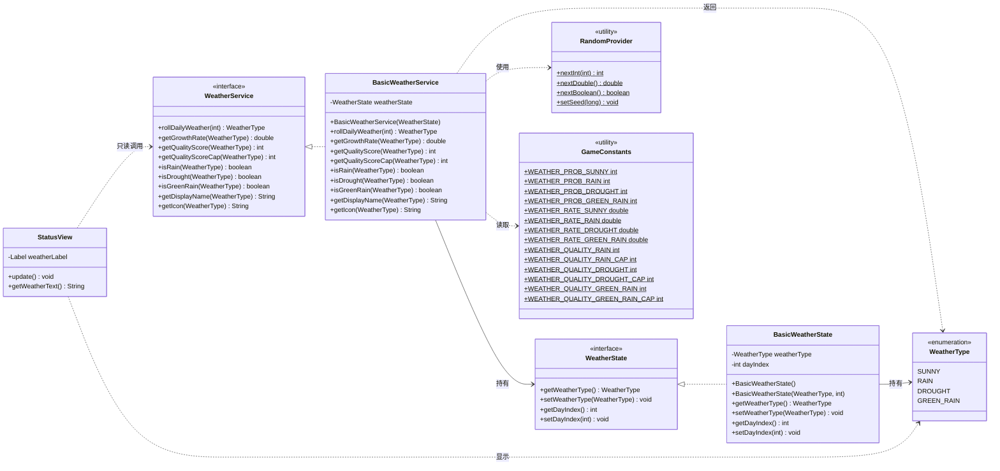

# D 模块 P1 接口与类设计文档（世界环境模块 · 天气系统）

> 作者：D 模块（zsl）｜ 阶段：P1（v0.2.0-playable）｜ 编码：UTF-8
> 上位规则：《FSF游戏规则设计文档.md》V4.0（唯一数值事实源）
> 阶段红线：《FSF_P0-P4功能实现与验收规范.md》V4.0
> 工程结构：《脚手架.md》｜ 分工：《模块分工.md》｜ 决策：《FSF项目需求分析与开发计划书.md》§决策记录
> 前置文档：《模块规范/D模块 P0 接口与类设计文档.md》

---

## 〇、文档定位与范围

本文档只定义 **D 模块（世界环境）在 P1 阶段** 的接口、类、包结构与类图。

D 模块 P1 的**唯一新增职责**是 **天气系统（Weather）**（《模块分工.md》第 7 行：D 模块 P1 = 天气）。

本文档**不定义**：

- 品质系统（C 模块，P1）；
- 肥料系统（C 模块，P1）；
- 枯萎系统（A 模块，P1）；
- 装饰 / Buff（B 模块，P1）；
- SQLite / DAO / 迁移（E 模块，P1）。

D 模块只**提供天气数据与倍率**，供上述模块读取；**不实现**它们的业务规则。

---

## 一、P1 需求分析（D 模块）

### 1.1 需求来源

| 需求 | 来源文档 | 章节 |
|---|---|---|
| P1 新增天气系统 | 验收规范 | §四十六、§四十八 |
| 天气四态与概率 | 规则文档 | §十九 |
| 天气成长倍率 | 规则文档 | §十九、§二十~§二十三 |
| 每天 00:00 生成一次天气 | 规则文档 | §十九、§八十一 |
| 天气记录字段（Crop 侧） | 验收规范 | §五十 |
| 雨天自动补水语义 | 规则文档 | §二十一 |
| 干旱 droughtStreak 语义 | 规则文档 | §二十二、§二十九 |
| 绿雨计数 | 规则文档 | §二十三 |
| 天气品质分（供 C 模块读取） | 规则文档 | §三十五 |
| 天气随机统一走 RandomProvider | 规则文档 | §九十 |
| 天气存档字段 current_weather | 验收规范 | §七十三 |
| 天气图标 / 说明 UI | 验收规范 | §七十六 |

### 1.2 天气数值（**唯一事实源：规则文档 §十九**）

| 天气 | 概率 | 成长倍率 | 品质分/次 | 品质分上限 |
|---|---:|---:|---:|---:|
| 晴天 SUNNY | 40% | ×1.0 | +0 | — |
| 雨天 RAIN | 25% | ×1.5 | +5 | +20 |
| 干旱 DROUGHT | 20% | ×0.5 | +8 | +24 |
| 绿雨 GREEN_RAIN | 15% | ×2.0 | +15 | +45 |

> 概率合计 100%。**禁止改动**（规则文档 §十九；验收规范 §四十七：P1 不得改变 P0 基础数值，只允许在原公式中加入新变量）。

### 1.3 天气生成时机（**唯一事实源：规则文档 §八十一**）

每个游戏日 **00:00** 为世界结算边界，其中第 ⑧ 步「生成新天气」。

P1 阶段 D 模块**只负责**「生成新天气」这一步（第 ⑧ 步）与「雨天自动补水」的**天气侧判定**（第 ⑨ 步的天气输入）。

> **阶段边界说明**：完整 12 步日结流程（含枯萎判定、事件抽取、DailyLog）跨越 A/C/D/E 多模块，属 P2「持续世界引擎」范畴。P1 阶段 D 模块提供 `WeatherService.rollDailyWeather()` 作为第 ⑧ 步的**可调用单元**，由 Controller / 上层协调器在跨日时调用；D 模块**不**自行实现完整日结循环（避免越界实现 P2 功能，验收规范 §十、§四十七）。

### 1.4 天气与成长公式的关系（**唯一事实源：验收规范 §四十九**）

P1 成长公式升级为：

```text
GrowthDelta = BaseDailyProgress × ElapsedGameDays × WeatherRate × OperationRate
```

- `WeatherRate` 由 **D 模块** `WeatherService.getGrowthRate(WeatherType)` 提供；
- `OperationRate` 由 **A 模块** WateringService 提供（P0 已有）；
- 公式的**组装**由 **A 模块** GrowthService 完成（A 模块职责，D 不越界）。

> D 模块只**提供倍率值**，不参与成长计算（统一 Model / Service 归属原则，验收规范 §3.1、§一百五十）。

### 1.5 天气记录字段归属（**唯一事实源：验收规范 §五十、§六十四**）

验收规范 §五十要求 `Crop` 增加：

```java
int droughtCount;
int rainCount;
int greenRainCount;
LocalDateTime lastHydratedTime;
int droughtStreak;
```

> **⚠ 文档矛盾报告（强制停止项）**：
> 验收规范 §五十 使用 `LocalDateTime lastHydratedTime`，但**决策记录 D14** 已裁定「A 侧时间字段统一 `long`」，且规则文档 §二十五 亦写作 `LocalDateTime lastHydratedTime`。
> 该字段属 **A 模块 Crop 模型**（非 D 模块），D 模块**不持有、不修改** Crop 字段。
> **处理方式**：D 模块在本文档中**仅记录该矛盾**，按 D14 精神建议 A 模块将 `lastHydratedTime` 统一为 `long`（游戏小时），**由 A 模块（lyj）最终裁定并同步 A 设计文档**。D 模块不自行选择其一（遵守「发现矛盾立即停止并报告」约束）。
> 详见本文档 §九「跨模块矛盾与待裁定项」。

### 1.6 D 模块 P1 明确不做（阶段边界）

| 不做项 | 归属阶段/模块 | 依据 |
|---|---|---|
| 随机事件（EventType 业务化） | P2 / D | 验收规范 §九十 |
| 离线模拟 / 持续世界 | P2 / B·D | 验收规范 §八十五 |
| 枯萎判定（WitherService） | P1 / A | 模块分工第 4 行 |
| 品质计算（QualityService） | P1 / C | 模块分工第 6 行 |
| 装饰 Buff（BuffService） | P1 / B | 模块分工第 5 行 |
| SQLite world_state 落库 | P1 / E | 验收规范 §七十三 |
| 天气动画 / 音效 | P4 / D | 模块分工第 7 行 |

---

## 二、包结构设计

### 2.1 包结构（遵循决策 D13：接口在包根，实现类以 Basic 前缀放 impl 子包）

```text
com.fieldstory.farm
│
├── model
│   ├── WeatherType.java              （P0 已存在，P1 启用；枚举不拆接口，决策 D13）
│   └── WeatherState.java             【P1 新增】天气状态模型（接口）
│
├── model.impl
│   └── BasicWeatherState.java        【P1 新增】WeatherState 基础实现
│
├── service
│   └── WeatherService.java           【P1 新增】天气服务接口
│
├── service.impl
│   └── BasicWeatherService.java      【P1 新增】WeatherService 基础实现
│
├── util
│   ├── GameConstants.java            （P0 已存在，P1 追加天气常量）
│   └── RandomProvider.java           （P0 已存在，P1 正式启用）
│
└── view
    └── StatusView.java               （P0 已存在，P1 升级天气显示）
```

### 2.2 包结构说明

| 包 | 新增/修改 | 说明 |
|---|---|---|
| `model` | 新增 `WeatherState` | 天气状态接口，只保存「现在是什么天气」（统一 Model 原则） |
| `model.impl` | 新增 `BasicWeatherState` | 实现类，与 `BasicGameClock` 对称（决策 D13） |
| `service` | 新增 `WeatherService` | 天气业务接口（生成、倍率、品质分） |
| `service.impl` | 新增 `BasicWeatherService` | 实现类，与 `BasicGrowthService` 对称 |
| `util` | 修改 `GameConstants` | 追加天气概率/倍率/品质分常量（禁止魔法数字） |
| `view` | 修改 `StatusView` | 天气图标 + 说明（验收规范 §七十六） |

> **不新增 `dao` 包**：P1 天气落库由 E 模块 `WorldStateDao` 负责（验收规范 §七十五），D 模块不直接写 SQL（验收规范 §七十五：Service 不得直接写 SQL）。

---

## 三、类图（接口 + 实现类拆分）

### 3.1 类图（Mermaid）



### 3.2 类图（文本版，便于无 Mermaid 环境阅读）

```text
                    ┌─────────────────────┐
                    │   <<enum>>          │
                    │   WeatherType       │  (model, P0 已存在)
                    │  SUNNY/RAIN/        │
                    │  DROUGHT/GREEN_RAIN │
                    └──────────┬──────────┘
                               │ 被持有/返回
          ┌────────────────────┼────────────────────┐
          │                    │                    │
          ▼                    ▼                    ▼
┌──────────────────┐  ┌──────────────────┐  ┌──────────────────┐
│ <<interface>>    │  │ <<interface>>    │  │  StatusView      │
│ WeatherState     │  │ WeatherService   │  │  (view, P1 升级) │
│ +getWeatherType  │  │ +rollDailyWeather│  │  +update()       │
│ +setWeatherType  │  │ +getGrowthRate   │  │  +getWeatherText │
│ +getDayIndex     │  │ +getQualityScore │  └────────┬─────────┘
│ +setDayIndex     │  │ +getQualityScoreCap│         │ 只读
└────────┬─────────┘  │ +isRain/isDrought│          │
         │            │ +isGreenRain     │          │
         │ 实现        │ +getDisplayName  │          │
         ▼            │ +getIcon         │          │
┌──────────────────┐  └────────┬─────────┘          │
│ BasicWeatherState│           │ 实现               │
│ (model.impl)     │           ▼                    │
└──────────────────┘  ┌──────────────────────┐      │
                      │ BasicWeatherService  │◄─────┘
                      │ (service.impl)       │
                      └──────┬───────┬───────┘
                             │       │
                    使用     ▼       ▼   读取
              ┌──────────────┐  ┌──────────────┐
              │RandomProvider│  │GameConstants │
              │ (util, P0)   │  │ (util, P1 追加)│
              └──────────────┘  └──────────────┘
```

### 3.3 依赖方向（严格遵守分层，禁止越层）

```text
View (StatusView)
  ↓ 只读调用
Service (WeatherService)
  ↓ 使用
Model (WeatherState / WeatherType)
  ↓ 使用
Util (RandomProvider / GameConstants)
```

- **禁止** View 直接调用 Model 写方法；
- **禁止** Service 直接写 SQL（验收规范 §七十五）；
- **禁止** D 模块 Service 依赖 A/C/B 模块 Service（避免跨模块耦合，验收规范 §一百五十二）。

---

## 四、接口与类详细设计

### 4.1 WeatherType（枚举，P0 已存在，P1 启用）

- 全名：`com.fieldstory.farm.model.WeatherType`
- 状态：**P0 已定义**（D 模块 P0 文档 §8.1），P1 **不改动常量集**（枚举名即存档字符串，E 模块以 `name()` 存取）。
- 常量：`SUNNY, RAIN, DROUGHT, GREEN_RAIN`
- 依据：验收规范 §四十八；规则文档 §十九。

> **不改动理由**：E 模块 `world_state.current_weather` 以枚举 `name()` 存取（验收规范 §七十三），改动枚举名会破坏存档兼容。

### 4.2 WeatherState（接口，P1 新增）

- 全名：`com.fieldstory.farm.model.WeatherState`
- 实现类：`com.fieldstory.farm.model.impl.BasicWeatherState`
- 依据：决策 D13（接口在包根，实现类以 Basic 前缀放 impl 子包）

```java
package com.fieldstory.farm.model;

public interface WeatherState {

    /** 当前天气类型（规则文档 §十九） */
    WeatherType getWeatherType();

    void setWeatherType(WeatherType weatherType);

    /** 当前天气所属游戏日索引（从 1 开始，规则文档 §八十一） */
    int getDayIndex();

    void setDayIndex(int dayIndex);
}
```

**行为约束**

| 约束项 | 约束内容 | 来源 |
|---|---|---|
| 只保存状态 | 不含任何天气生成/概率计算逻辑（统一 Model 原则） | 验收规范 §四 |
| 默认值 | 无参构造默认 `SUNNY`、`dayIndex = 1`（P0 固定晴天，验收规范 §七十六） | 验收规范 §七十六 |
| 存档字段 | 对应 E 模块 `world_state.current_weather`（枚举 `name()`） | 验收规范 §七十三 |

### 4.3 BasicWeatherState（实现类，P1 新增）

- 全名：`com.fieldstory.farm.model.impl.BasicWeatherState`
- 依据：决策 D13

```java
package com.fieldstory.farm.model.impl;

import com.fieldstory.farm.model.WeatherState;
import com.fieldstory.farm.model.WeatherType;

public class BasicWeatherState implements WeatherState {

    private WeatherType weatherType;
    private int dayIndex;

    public BasicWeatherState() {
        this(WeatherType.SUNNY, 1);
    }

    public BasicWeatherState(WeatherType weatherType, int dayIndex) {
        this.weatherType = weatherType;
        this.dayIndex = dayIndex;
    }

    // 实现所有接口方法...
}
```

**构造器约束**

| 构造器 | 约束 |
|---|---|
| 无参 | 默认 `SUNNY`、`dayIndex = 1`（P0 固定晴天语义延续） |
| 双参 | 接受 `WeatherType` 与 `int dayIndex`，用于存档恢复 |

### 4.4 WeatherService（接口，P1 新增）

- 全名：`com.fieldstory.farm.service.WeatherService`
- 实现类：`com.fieldstory.farm.service.impl.BasicWeatherService`
- 依据：验收规范 §一百五十（P1 新增 Service 清单含 `WeatherService`）

```java
package com.fieldstory.farm.service;

import com.fieldstory.farm.model.WeatherType;

public interface WeatherService {

    /** 生成指定游戏日的天气（每天 00:00 调用一次，规则文档 §十九/§八十一） */
    WeatherType rollDailyWeather(int dayIndex);

    /** 天气成长倍率（验收规范 §四十九） */
    double getGrowthRate(WeatherType weatherType);

    /** 天气品质分/次（规则文档 §三十五） */
    int getQualityScore(WeatherType weatherType);

    /** 天气品质分上限（规则文档 §三十五） */
    int getQualityScoreCap(WeatherType weatherType);

    /** 是否雨天（供 A 模块自动补水判定，规则文档 §二十一） */
    boolean isRain(WeatherType weatherType);

    /** 是否干旱（供 A 模块 droughtStreak 判定，规则文档 §二十二） */
    boolean isDrought(WeatherType weatherType);

    /** 是否绿雨（供 C 模块传说突破加成，规则文档 §二十三） */
    boolean isGreenRain(WeatherType weatherType);

    /** 天气显示名（UI，验收规范 §七十六） */
    String getDisplayName(WeatherType weatherType);

    /** 天气图标（UI，验收规范 §七十六） */
    String getIcon(WeatherType weatherType);
}
```

**方法约束**

| 方法 | 约束 | 来源 |
|---|---|---|
| `rollDailyWeather(int)` | 按 40/25/20/15 概率抽取；必须经 `RandomProvider`；返回并写入 `WeatherState` | 规则文档 §十九、§九十 |
| `getGrowthRate` | 返回 1.0/1.5/0.5/2.0 | 规则文档 §十九 |
| `getQualityScore` | 返回 0/5/8/15 | 规则文档 §三十五 |
| `getQualityScoreCap` | 返回 0/20/24/45 | 规则文档 §三十五 |
| `isRain/isDrought/isGreenRain` | 纯判定，无副作用 | 规则文档 §二十一~§二十三 |
| `getDisplayName/getIcon` | 纯展示，无业务逻辑 | 验收规范 §七十六 |

### 4.5 BasicWeatherService（实现类，P1 新增）

- 全名：`com.fieldstory.farm.service.impl.BasicWeatherService`
- 依据：验收规范 §一百五十

```java
package com.fieldstory.farm.service.impl;

import com.fieldstory.farm.model.WeatherState;
import com.fieldstory.farm.model.WeatherType;
import com.fieldstory.farm.service.WeatherService;
import com.fieldstory.farm.util.RandomProvider;
import static com.fieldstory.farm.util.GameConstants.*;

public class BasicWeatherService implements WeatherService {

    private final WeatherState weatherState;

    public BasicWeatherService(WeatherState weatherState) {
        this.weatherState = weatherState;
    }

    @Override
    public WeatherType rollDailyWeather(int dayIndex) {
        int roll = RandomProvider.nextInt(100);   // [0,100)
        WeatherType type;
        if (roll < WEATHER_PROB_SUNNY) {                 // 0~39  → 40%
            type = WeatherType.SUNNY;
        } else if (roll < WEATHER_PROB_SUNNY + WEATHER_PROB_RAIN) {   // 40~64 → 25%
            type = WeatherType.RAIN;
        } else if (roll < WEATHER_PROB_SUNNY + WEATHER_PROB_RAIN + WEATHER_PROB_DROUGHT) { // 65~84 → 20%
            type = WeatherType.DROUGHT;
        } else {                                          // 85~99 → 15%
            type = WeatherType.GREEN_RAIN;
        }
        weatherState.setWeatherType(type);
        weatherState.setDayIndex(dayIndex);
        return type;
    }

    // 其余方法按常量表返回...
}
```

**概率抽取算法说明**

- 使用 `RandomProvider.nextInt(100)` 得到 `[0, 100)` 整数；
- 区间划分：`[0,40)` 晴、`[40,65)` 雨、`[65,85)` 旱、`[85,100)` 绿雨；
- 区间宽度严格等于 40/25/20/15，**合计 100**；
- 必须经 `RandomProvider`（规则文档 §九十），**禁止** `new Random()`。

### 4.6 GameConstants（P1 追加常量）

在 P0 已有常量基础上追加（**禁止魔法数字**，规则文档 §八）：

```java
// ===== P1 天气概率（规则文档 §十九）=====
public static final int WEATHER_PROB_SUNNY = 40;
public static final int WEATHER_PROB_RAIN = 25;
public static final int WEATHER_PROB_DROUGHT = 20;
public static final int WEATHER_PROB_GREEN_RAIN = 15;

// ===== P1 天气成长倍率（规则文档 §十九）=====
public static final double WEATHER_RATE_SUNNY = 1.0;
public static final double WEATHER_RATE_RAIN = 1.5;
public static final double WEATHER_RATE_DROUGHT = 0.5;
public static final double WEATHER_RATE_GREEN_RAIN = 2.0;

// ===== P1 天气品质分（规则文档 §三十五）=====
public static final int WEATHER_QUALITY_RAIN = 5;
public static final int WEATHER_QUALITY_RAIN_CAP = 20;
public static final int WEATHER_QUALITY_DROUGHT = 8;
public static final int WEATHER_QUALITY_DROUGHT_CAP = 24;
public static final int WEATHER_QUALITY_GREEN_RAIN = 15;
public static final int WEATHER_QUALITY_GREEN_RAIN_CAP = 45;
```

> **命名说明**：P0 的 `WEATHER_RATE_P0 = 1.0` 保留（P0 固定占位），P1 新增按天气细分的倍率常量，二者不冲突。

### 4.7 StatusView（P1 升级）

- 全名：`com.fieldstory.farm.view.StatusView`（P0 已存在）
- P1 改动：`weatherLabel` 由固定「晴天」升级为「图标 + 显示名」，数据来自 `WeatherService`（只读）。

```java
// P1 升级点（示意）
public void update() {
    // ... 原有 day/time/gold 逻辑不变 ...
    WeatherType type = weatherState.getWeatherType();
    weatherLabel.setText(weatherService.getIcon(type) + " " + weatherService.getDisplayName(type));
}
```

**约束**

| 约束项 | 约束内容 | 来源 |
|---|---|---|
| 只读原则 | 只调用 `WeatherService` 的**查询**方法，不得调用 `rollDailyWeather` | 验收规范 §3.1 |
| 显示内容 | 天气图标 + 天气说明 | 验收规范 §七十六 |
| NPE 保护 | `weatherState` 为 null 时显示占位，不抛异常 | 非功能需求 §2.2 |

---

## 五、跨模块接口约定

### 5.1 与 A 模块（土地与作物）

| 约定项 | 内容 | 来源 |
|---|---|---|
| 成长倍率 | A 模块 `GrowthService` 调用 `WeatherService.getGrowthRate(type)` 获取 `WeatherRate` | 验收规范 §四十九 |
| 雨天补水 | A 模块用 `WeatherService.isRain(type)` 判定是否触发自动补水 | 规则文档 §二十一 |
| 干旱判定 | A 模块用 `WeatherService.isDrought(type)` 更新 `droughtStreak` | 规则文档 §二十二、§二十九 |
| 天气记录字段 | `droughtCount/rainCount/greenRainCount/droughtStreak` 属 **A 模块 Crop**，D 不持有 | 验收规范 §五十 |
| 时间字段矛盾 | `lastHydratedTime` 类型待 A 裁定（见 §九） | 决策 D14 vs 验收规范 §五十 |

### 5.2 与 C 模块（品质与传说）

| 约定项 | 内容 | 来源 |
|---|---|---|
| 天气品质分 | C 模块 `QualityService` 调用 `getQualityScore/getQualityScoreCap` | 规则文档 §三十五 |
| 绿雨突破 | C 模块用 `isGreenRain(type)` 计算传说突破加成（P2 启用） | 规则文档 §二十三 |

### 5.3 与 E 模块（存档）

| 约定项 | 内容 | 来源 |
|---|---|---|
| 存档字段 | E 模块 `world_state.current_weather` 保存天气枚举 `name()` | 验收规范 §七十三 |
| 天气日索引 | E 模块 `world_state.current_day_index` 保存 `WeatherState.getDayIndex()` | 验收规范 §七十三 |
| 随机种子 | E 模块 `world_state.random_seed` 保存种子，供 `RandomProvider.setSeed` 复现 | 验收规范 §七十三、规则文档 §九十 |
| 落库职责 | 由 E 模块 `WorldStateDao` 落库，D 不直接写 SQL | 验收规范 §七十五 |

### 5.4 与 B 模块（玩家与经营）

| 约定项 | 内容 | 来源 |
|---|---|---|
| 装饰 Buff | 装饰对成长/品质的影响由 B 模块 `BuffService` 提供，D 不参与 | 模块分工第 5 行 |
| 无直接依赖 | D 与 B 在 P1 无直接接口依赖 | — |

---

## 六、单元测试要求（P1）

依据验收规范 §七十八（P1 新增测试清单含 `WeatherServiceTest`）。

### 6.1 WeatherServiceTest

| 测试场景 | 预期结果 | 来源 |
|---|---|---|
| 固定种子下 `rollDailyWeather` 序列可复现 | 两次相同种子得到相同序列 | 规则文档 §九十 |
| 大量抽样（如 10000 次）概率分布 | 晴≈40%、雨≈25%、旱≈20%、绿雨≈15%（容差 ±3%） | 规则文档 §十九 |
| `getGrowthRate` 四态 | 1.0 / 1.5 / 0.5 / 2.0 | 规则文档 §十九 |
| `getQualityScore` 四态 | 0 / 5 / 8 / 15 | 规则文档 §三十五 |
| `getQualityScoreCap` 四态 | 0 / 20 / 24 / 45 | 规则文档 §三十五 |
| `isRain/isDrought/isGreenRain` | 仅对应天气返回 true | 规则文档 §二十一~§二十三 |
| `rollDailyWeather` 写入 WeatherState | `getWeatherType()` 与返回值一致 | — |

### 6.2 BasicWeatherStateTest

| 测试场景 | 预期结果 | 来源 |
|---|---|---|
| 无参构造 | `SUNNY`、`dayIndex = 1` | 验收规范 §七十六 |
| 双参构造 | 字段正确赋值 | — |
| setter/getter 往返 | 值一致 | — |

### 6.3 WeatherTypeTest（P0 已存在，P1 保持）

- 保持 P0 测试不变（枚举常量集与 `name()` 稳定性），防止破坏存档映射。

### 6.4 StatusViewTest（P1 扩展）

| 测试场景 | 预期结果 | 来源 |
|---|---|---|
| 天气显示 | 显示「图标 + 显示名」 | 验收规范 §七十六 |
| `weatherState` 为 null | 显示占位，不抛 NPE | 非功能需求 §2.2 |

---

## 七、编码前自检清单

| 检查项 | 状态 |
|---|---|
| `WeatherState` 接口放 `model` 包，`BasicWeatherState` 放 `model.impl`（决策 D13） | ☐ |
| `WeatherService` 接口放 `service` 包，`BasicWeatherService` 放 `service.impl` | ☐ |
| 天气概率 40/25/20/15 与规则文档 §十九 一致 | ☐ |
| 天气倍率 1.0/1.5/0.5/2.0 与规则文档 §十九 一致 | ☐ |
| 天气品质分 0/5/8/15、上限 0/20/24/45 与规则文档 §三十五 一致 | ☐ |
| 天气生成必须经 `RandomProvider`，无 `new Random()` | ☐ |
| 所有数值经 `GameConstants` 引用，无魔法数字 | ☐ |
| `WeatherType` 枚举常量集不改动（存档兼容） | ☐ |
| D 模块不持有 Crop 天气记录字段（属 A 模块） | ☐ |
| D 模块不实现枯萎/品质/装饰/事件业务 | ☐ |
| D 模块不直接写 SQL | ☐ |
| `StatusView` 只读，不调用 `rollDailyWeather` | ☐ |
| 包名统一为 `com.fieldstory.farm.*` | ☐ |
| 单元测试覆盖固定种子与概率分布 | ☐ |
| 文档矛盾（`lastHydratedTime` 类型）已报告，未自行裁定 | ☐ |

---

## 八、约束来源索引

| 约束内容 | 文档来源 | 章节 |
|---|---|---|
| 天气四态与概率 40/25/20/15 | 规则文档 | §十九 |
| 天气成长倍率 1.0/1.5/0.5/2.0 | 规则文档 | §十九 |
| 每天 00:00 生成天气 | 规则文档 | §十九、§八十一 |
| 雨天自动补水语义 | 规则文档 | §二十一 |
| 干旱 droughtStreak 语义 | 规则文档 | §二十二、§二十九 |
| 绿雨计数与突破加成 | 规则文档 | §二十三 |
| 天气品质分 0/5/8/15、上限 0/20/24/45 | 规则文档 | §三十五 |
| 随机统一走 RandomProvider | 规则文档 | §九十 |
| P1 成长公式含 WeatherRate | 验收规范 | §四十九 |
| P1 新增 WeatherService | 验收规范 | §一百五十 |
| 天气记录字段（Crop 侧） | 验收规范 | §五十 |
| 天气存档字段 current_weather | 验收规范 | §七十三 |
| 天气图标/说明 UI | 验收规范 | §七十六 |
| P1 新增测试 WeatherServiceTest | 验收规范 | §七十八 |
| 接口在包根，实现类在 impl | 决策记录 | D13 |
| 时间字段统一 long | 决策记录 | D14 |
| 世界时间存档字段 | 决策记录 | D15 |
| D 模块 P1 = 天气 | 模块分工 | 第 7 行 |
| 分层架构固定 | 验收规范 | §3.1 |
| Service 不得直接写 SQL | 验收规范 | §七十五 |

---

## 九、跨模块矛盾与待裁定项（强制报告）

> 依据会话约束「发现文档间矛盾时立即停止并报告，禁止自行选择其中一种」。

### 矛盾 1：`lastHydratedTime` 字段类型

| 文档 | 表述 |
|---|---|
| 验收规范 §五十 | `LocalDateTime lastHydratedTime;` |
| 规则文档 §二十五 | `LocalDateTime lastHydratedTime;` |
| 决策记录 D14 | 「A 侧时间字段统一 `long`」 |

- **影响范围**：A 模块 `Crop` 模型（非 D 模块）。
- **D 模块处理**：D 不持有该字段，**不自行裁定**；建议 A 模块（lyj）按 D14 统一为 `long`（游戏小时），并同步 A 设计文档 §8.4/§9。
- **待裁定人**：A 模块（lyj）。

### 矛盾 2：天气生成时机的阶段归属

| 文档 | 表述 |
|---|---|
| 规则文档 §八十一 | 完整 12 步日结流程（含天气生成第 ⑧ 步） |
| 验收规范 §四十六 | P1 新增天气系统 |
| 验收规范 §八十五 | 离线模拟属 P2 |

- **分析**：完整日结循环跨越 A/C/D/E 多模块，且含枯萎判定（A）、事件抽取（P2）、DailyLog（E）。
- **D 模块处理**：P1 阶段 D 只提供 `rollDailyWeather()` 作为第 ⑧ 步的**可调用单元**，由上层协调器在跨日时调用；D **不**自行实现完整日结循环（避免越界实现 P2 功能）。
- **待裁定人**：团队（跨模块协调）。

### 矛盾 3：天气品质分上限的「次」口径

| 文档 | 表述 |
|---|---|
| 规则文档 §三十五 | 雨天 +5/次，上限 +20；干旱 +8/次，上限 +24；绿雨 +15/次，上限 +45 |
| 验收规范 §五十八 | 与规则文档一致 |

- **分析**：上限与单次分值的整除关系为 20/5=4、24/8=3、45/15=3，即「有效计次」分别为 4/3/3 次。
- **D 模块处理**：D 只提供**单次分值与上限常量**，**计次与封顶逻辑由 C 模块 QualityService 实现**（D 不越界）。D 不裁定「第几次开始封顶」的边界语义，仅按规则文档提供常量。
- **待裁定人**：C 模块（hy）。

---

## 十、P1 交付物清单（D 模块）

| # | 交付物 | 类型 | 状态 |
|---|---|---|---|
| 1 | `WeatherState` | 接口（model） | 待实现 |
| 2 | `BasicWeatherState` | 实现类（model.impl） | 待实现 |
| 3 | `WeatherService` | 接口（service） | 待实现 |
| 4 | `BasicWeatherService` | 实现类（service.impl） | 待实现 |
| 5 | `GameConstants` 天气常量 | 修改（util） | 待追加 |
| 6 | `StatusView` 天气显示 | 修改（view） | 待升级 |
| 7 | `WeatherServiceTest` | 测试 | 待编写 |
| 8 | `BasicWeatherStateTest` | 测试 | 待编写 |

> 本文档为 **P1 需求分析与设计** 交付物；上述代码交付物在后续编码任务中实现（本次任务要求「不要编译代码」）。

---

## 十一、溯源说明（关键数值/规则来源）

| 关键数值/规则 | 来源文档 | 章节 |
|---|---|---|
| 天气概率 40% / 25% / 20% / 15% | 《FSF游戏规则设计文档.md》 | §十九 |
| 天气成长倍率 ×1.0 / ×1.5 / ×0.5 / ×2.0 | 《FSF游戏规则设计文档.md》 | §十九 |
| 天气品质分 +0 / +5 / +8 / +15 | 《FSF游戏规则设计文档.md》 | §三十五 |
| 天气品质分上限 +20 / +24 / +45 | 《FSF游戏规则设计文档.md》 | §三十五 |
| 每天 00:00 生成天气 | 《FSF游戏规则设计文档.md》 | §十九、§八十一 |
| 雨天自动补水（不增 manualWaterCount） | 《FSF游戏规则设计文档.md》 | §二十一 |
| 干旱 droughtStreak 语义 | 《FSF游戏规则设计文档.md》 | §二十二、§二十九 |
| 绿雨计数与突破加成 | 《FSF游戏规则设计文档.md》 | §二十三 |
| 随机统一走 RandomProvider | 《FSF游戏规则设计文档.md》 | §九十 |
| P1 成长公式含 WeatherRate | 《FSF_P0-P4功能实现与验收规范.md》 | §四十九 |
| P1 新增 WeatherService | 《FSF_P0-P4功能实现与验收规范.md》 | §一百五十 |
| 天气记录字段（Crop 侧） | 《FSF_P0-P4功能实现与验收规范.md》 | §五十 |
| 天气存档字段 current_weather | 《FSF_P0-P4功能实现与验收规范.md》 | §七十三 |
| 天气图标/说明 UI | 《FSF_P0-P4功能实现与验收规范.md》 | §七十六 |
| P1 新增测试 WeatherServiceTest | 《FSF_P0-P4功能实现与验收规范.md》 | §七十八 |
| 接口在包根，实现类在 impl | 《FSF项目需求分析与开发计划书.md》 | 决策 D13 |
| 时间字段统一 long | 《FSF项目需求分析与开发计划书.md》 | 决策 D14 |
| 世界时间存档字段 | 《FSF项目需求分析与开发计划书.md》 | 决策 D15 |
| D 模块 P1 = 天气 | 《模块分工.md》 | 第 7 行 |
| 分层架构固定 | 《FSF_P0-P4功能实现与验收规范.md》 | §3.1 |
| Service 不得直接写 SQL | 《FSF_P0-P4功能实现与验收规范.md》 | §七十五 |
| 包结构（model/service/util/view） | 《脚手架.md》 | §六、§七 |
